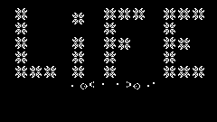

# LifeGame



Это игра [жизнь](https://ru.wikipedia.org/wiki/Игра_«Жизнь»)

## Требования

-python3

-[numpy](https://numpy.org)

-[pygame](https://www.pygame.org)

## Руководство

Запустите игру командой ```python3 LifeGame2.py```.

Если в директории с исполняемым файлом будет находиться файл ```data.png```, первое поколение будет загружено из него.

Управление в игре осуществляется следующими клавишами:

1. ```q``` - выход. Выйти из игры.
2. ```p``` - пауза. В режиме паузы можно изменять текущее поле. Левой кнопкой мыши добавить клекту, правой - удалить.
3. ```s``` - сохранить. Текущее поле сохраняется в виде картинки в файл data.png.
4. ```l``` - загрузить. Загружает из файла data.png поле.
5. ```с``` - очистить. Очищает поле.
